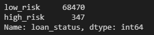

# Credit Risk Analysis Using Machine Learning

### Overview
Use data from LendingTree and predict which candidates are 'low_risk' and 'high_risk'. The models used to evaluate and compares results are as follows:
credit risk, evaluate the performance of different Machine Learning models. Dataset was split into inputs and outputs. Since the data is imbalanced we will incorporate sampling strategies to improve the model's prediction for Credit Loss or risk.
 1. Logistic Regression using Naive Random Over Sampling
 2. Logistic Regression using SMOTE Over Sampling
 3. Logistic Regression using Cluster Centroids Under Sampling
 4. Logistic Regression using SMOTEENN a combined sampling
 5. Balanced Random Forest Classifier
 6. AdaBoost (Adaptive Boost) Classifier

### Resource
 - Jupyter Lab v2.2.6
 - VS Code v1.52.1
 - Data Resource - `LoanStats_2019Q1.csv`

### Results
 - Based on the data we can see that the target classes are imbalanced

 

 

 

 - Logistic Regression using Naive Random Over Sampling
 

 

 - Logistic Regression using SMOTE
 

 

 - Logistic Regression using Cluster Centroids Under Sampling
 

 

- Logistic Regression using SMOTEENN a combined sampling

 

- Balanced Random Forest Classifier

 

- AdaBoost (Adaptive Boost) Classifier

### Summary

1. Analysis of the above results shows that the above predictions have a very low precision score for high-risk applications.
2. There is an inherent imbalance in the dataset where there is a majority of Low-risk applications compared to high-risk applications.
3. The confusion matrix for all model show a skewed bias towards False Negatives, i.e Candidates labelled as low-risk even though they are high-risk.
4. Next step will improve the model by reducing the number of independent features and scale the features. 